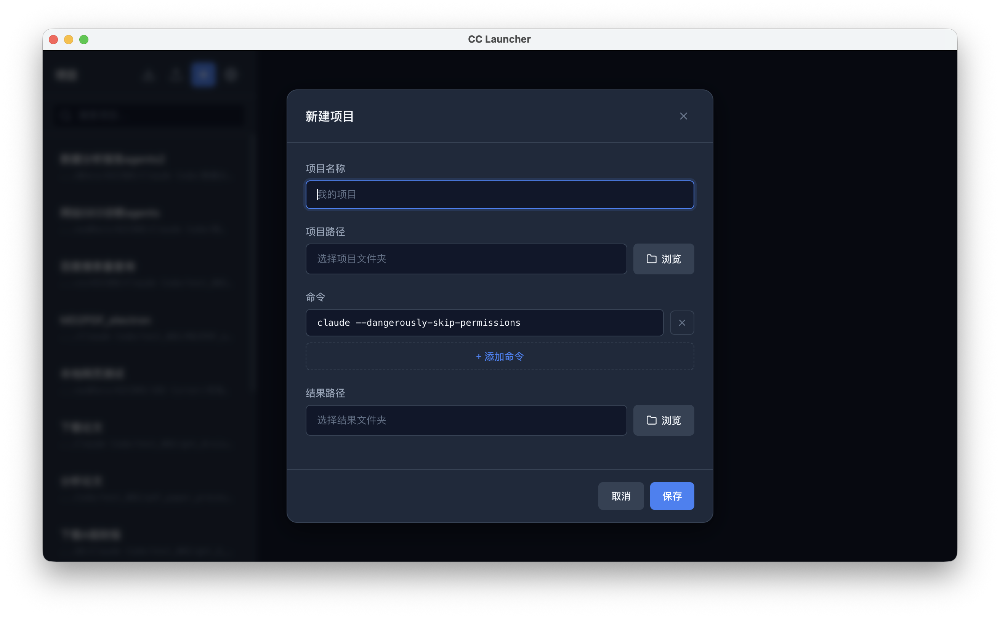
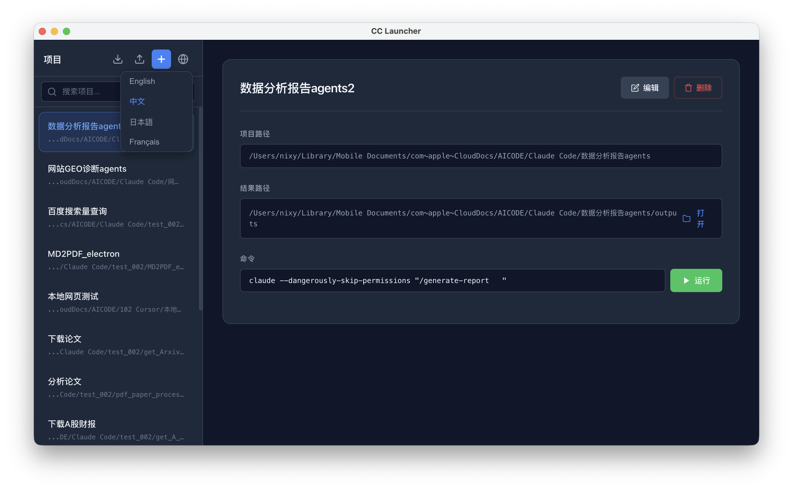

<p align="center">
  
</p>

<h1 align="center">CC Launcher</h1>

<p align="center">
  <strong>一个优雅的万能命令启动器，让你一键启动任何应用、脚本和工作流。</strong>
</p>

<p align="center">
  <a href="#功能亮点">功能</a> •
  <a href="#截图预览">截图</a> •
  <a href="#快速开始">安装</a> •
  <a href="#使用场景">场景</a> •
  <a href="#多语言">i18n</a> •
  <a href="#license">License</a>
</p>

<p align="center">
  
  
  
  
</p>

---

## 这不只是 Claude Code 启动器

虽然名字里带着 "CC"，但 CC Launcher 是一个通用的命令启动器。任何能通过终端命令启动的东西，它都能管：

| 场景 | 示例命令 |
|------|---------|
| AI 编程助手 | `claude --dangerously-skip-permissions` |
| Web 开发 | `npm run dev` / `yarn start` |
| Docker 服务 | `docker compose up -d` |
| Python 项目 | `python main.py` / `uvicorn app:app` |
| 自动化脚本 | `./deploy.sh` / `make build` |
| 任意程序 | 你能在终端里敲的，这里都能一键跑 |

> 把它想象成一个可视化的、带项目管理功能的终端快捷方式面板。

---

## 功能亮点

- **项目管理** — 集中管理所有项目，告别在文件夹间反复跳转
- **多命令支持** — 每个项目可配置多条命令，开发、构建、部署一键切换
- **一键启动** — 点击 Run 即在系统终端中执行，无需手动 cd + 输入命令
- **拖拽排序** — 按使用频率自由排列项目顺序
- **即时搜索** — `⌘F` 快速定位项目，管理 50+ 项目也不慌
- **结果路径** — 为每个项目绑定输出目录，一键打开查看产物
- **导入/导出** — JSON 格式配置迁移，换机无忧
- **暗色主题** — 开发者友好的深色 UI，长时间使用不伤眼
- **多语言** — 内置 English / 中文 / 日本語 / Français
- **跨平台** — macOS、Windows、Linux 全覆盖
- **零依赖** — 纯 Electron + Node.js，无需 Python 或其他运行时
- **秒启动** — 无后端服务，打开即用

---

## 截图预览

### 主界面 — 项目列表 + 详情

<p align="center">
  
</p>

> 左侧项目列表，右侧项目详情与命令面板。暗色主题，开发者风格。

### 新建项目

<p align="center">
  
</p>

> 填写项目名称、选择路径、配置命令，几秒完成。

### 命令执行

<p align="center">
  
</p>

> 每条命令可直接编辑，回车或点击 Run 即在终端中启动。

### 多语言切换

<p align="center">
  
</p>

> 右上角一键切换语言，界面实时刷新。

---

## 使用场景

### 1. AI 编程工作流
管理多个 Claude Code / Cursor / Copilot 项目，每个项目配置不同的启动参数，一键进入工作状态。

### 2. 全栈开发者
前端项目 `npm run dev`、后端 `go run main.go`、数据库 `docker compose up` — 全部集中在一个面板里。

### 3. DevOps / 运维
部署脚本、监控启动、日志查看 — 把常用操作固化为项目命令，新人也能一键操作。

### 4. 数据科学
Jupyter Notebook、训练脚本、数据处理管道 — 每个实验一个项目卡片，井井有条。

### 5. 自由职业者
同时服务多个客户？每个客户一个项目，命令、路径、产物目录各自独立，互不干扰。

---

## 快速开始

### 从源码运行

```bash
git clone https://github.com/your-username/cc-launcher.git
cd cc-launcher
npm install
npm start
```

### 打包安装

```bash
# macOS (Apple Silicon)
npm run build:mac

# Windows
npm run build:win

# Linux
npm run build:linux
```

打包产物在 `dist/` 目录下。

---

## 键盘快捷键

| 快捷键 | 功能 |
|--------|------|
| `⌘N` / `Ctrl+N` | 新建项目 |
| `⌘F` / `Ctrl+F` | 搜索项目 |
| `Esc` | 关闭弹窗 |
| `Enter` | 在命令输入框中执行命令 |

---

## 多语言

内置 4 种语言，右上角地球图标一键切换：

| 语言 | 代码 |
|------|------|
| English | `en` |
| 简体中文 | `zh` |
| 日本語 | `ja` |
| Français | `fr` |

自动检测系统语言，也可手动切换并持久化保存。

---

## 数据存储

项目配置自动存储在系统用户数据目录（不在项目目录内）：

| 系统 | 路径 |
|------|------|
| macOS | `~/Library/Application Support/cc-launcher/data/` |
| Windows | `%APPDATA%/cc-launcher/data/` |
| Linux | `~/.config/cc-launcher/data/` |

数据变化时自动备份到 `projects_backup.json`，防止意外丢失。

---

## 技术栈

| 组件 | 技术 |
|------|------|
| 框架 | Electron 28 |
| 前端 | HTML / CSS / JavaScript |
| 数据层 | 纯 Node.js + JSON 文件存储 |
| 进程通信 | IPC (contextIsolation + preload) |
| 安全 | CSP 策略 / nodeIntegration 禁用 |
| 打包 | electron-builder |

---

## 项目结构

```
cc-launcher/
├── src/
│   ├── main/
│   │   ├── index.js          # 主进程入口
│   │   ├── ipc-handlers.js   # IPC 通信处理
│   │   └── store.js          # 数据持久化 (ProjectStore)
│   ├── renderer/
│   │   ├── index.html        # 界面
│   │   ├── app.js            # 前端逻辑
│   │   ├── styles.css        # 暗色主题样式
│   │   └── i18n.js           # 国际化模块
│   └── preload.js            # 预加载脚本 (安全桥接)
├── build/                    # 构建资源 (图标)
├── docs/                     # 文档与截图
│   ├── screenshots/          # README 截图
│   ├── ELECTRON_BEST_PRACTICES.md
│   └── ELECTRON_ICON_GUIDE.md
├── run.sh                    # 一键启动脚本
├── package.json
└── LICENSE
```

---

## Contributing

欢迎提交 Issue 和 Pull Request。

---

## License

[MIT](LICENSE)
