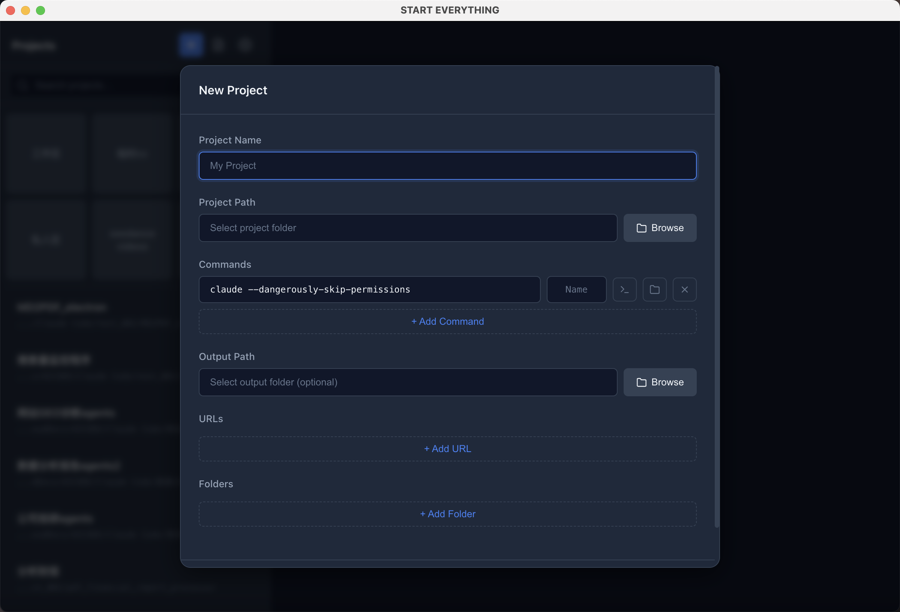
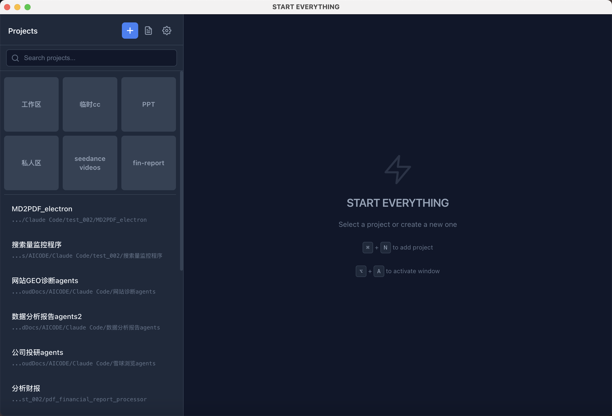

<p align="center">
  
</p>

<h1 align="center">Start Everything</h1>

<p align="center">
  <strong>An elegant universal launcher to start any app, script, or workflow with one click.</strong>
</p>

<p align="center">
  <a href="#features">Features</a> •
  <a href="#screenshots">Screenshots</a> •
  <a href="#quick-start">Installation</a> •
  <a href="#use-cases">Use Cases</a> •
  <a href="#i18n">i18n</a> •
  <a href="#license">License</a>
</p>

<p align="center">
  
  
  
  
</p>

---

## More Than Just a Launcher

Start Everything is a universal command launcher. Anything you can run in a terminal, it can manage:

| Scenario | Example Commands |
|----------|------------------|
| AI Coding Assistants | `claude --dangerously-skip-permissions` |
| Web Development | `npm run dev` / `yarn start` |
| Docker Services | `docker compose up -d` |
| Python Projects | `python main.py` / `uvicorn app:app` |
| Automation Scripts | `./deploy.sh` / `make build` |
| Any Program | If you can type it in a terminal, you can run it here |

> Think of it as a visual, project-aware terminal shortcut panel.

---

## Features

- **Project Management** — Centralize all projects, no more jumping between folders
- **Multi-Command Support** — Configure multiple commands per project, switch between dev/build/deploy with one click
- **One-Click Launch** — Click Run to execute in system terminal, no manual cd + typing
- **Drag & Drop Sorting** — Arrange projects by usage frequency
- **Instant Search** — `⌘F` to quickly locate projects, manage 50+ projects effortlessly
- **Result Path** — Bind output directory to each project, open results with one click
- **Import/Export** — JSON-based config migration, seamless machine transfer
- **Dark Theme** — Developer-friendly dark UI, easy on the eyes
- **Multi-Language** — Built-in English / 中文 / 日本語 / Français
- **Cross-Platform** — macOS, Windows, Linux fully supported
- **Zero Dependencies** — Pure Electron + Node.js, no Python or other runtimes
- **Instant Startup** — No backend service, ready to use immediately

---

## Screenshots

### Main Interface — Project List + Details

<p align="center">
  
</p>

> Left: project list, Right: project details and command panel. Dark theme, developer style.

### New Project

<p align="center">
  
</p>

> Fill in project name, select path, configure commands — done in seconds.

### Command Execution

<p align="center">
  
</p>

> Each command is directly editable, press Enter or click Run to launch in terminal.

### Multi-Language Switching

<p align="center">
  
</p>

> Top-right globe icon to switch languages, interface updates instantly.

---

## Use Cases

### 1. AI Coding Workflow
Manage multiple Claude Code / Cursor / Copilot projects, each with different launch parameters, enter work mode with one click.

### 2. Full-Stack Developers
Frontend `npm run dev`, backend `go run main.go`, database `docker compose up` — all in one panel.

### 3. DevOps / Operations
Deployment scripts, monitoring startup, log viewing — solidify common operations as project commands, even newcomers can operate with one click.

### 4. Data Science
Jupyter Notebook, training scripts, data processing pipelines — each experiment as a project card, well-organized.

### 5. Freelancers
Serving multiple clients? Each client as a project, commands, paths, output directories independent, no interference.

---

## Quick Start

### Run from Source

```bash
git clone https://github.com/nixyme/Start-Everything.git
cd Start-Everything
npm install
npm start
```

### Build & Install

```bash
# macOS (Apple Silicon)
npm run build:mac

# Windows
npm run build:win

# Linux
npm run build:linux
```

Build artifacts in `dist/` directory.

---

## Keyboard Shortcuts

| Shortcut | Function |
|----------|----------|
| `⌘N` / `Ctrl+N` | New Project |
| `⌘F` / `Ctrl+F` | Search Projects |
| `Esc` | Close Modal |
| `Enter` | Execute Command in Input Box |

---

## i18n

Built-in 4 languages, top-right globe icon to switch:

| Language | Code |
|----------|------|
| English | `en` |
| 简体中文 | `zh` |
| 日本語 | `ja` |
| Français | `fr` |

Auto-detects system language, can also manually switch and persist.

---

## Data Storage

Project configs auto-saved in system user data directory (not in project folder):

| System | Path |
|--------|------|
| macOS | `~/Library/Application Support/start-everything/data/` |
| Windows | `%APPDATA%/start-everything/data/` |
| Linux | `~/.config/start-everything/data/` |

Auto-backup to `projects_backup.json` on data changes, prevents accidental loss.

---

## Tech Stack

| Component | Technology |
|-----------|------------|
| Framework | Electron 28 |
| Frontend | HTML / CSS / JavaScript |
| Data Layer | Pure Node.js + JSON file storage |
| IPC | IPC (contextIsolation + preload) |
| Security | CSP policy / nodeIntegration disabled |
| Build | electron-builder |

---

## Project Structure

```
Start-Everything/
├── src/
│   ├── main/
│   │   ├── index.js          # Main process entry
│   │   ├── ipc-handlers.js   # IPC communication handlers
│   │   └── store.js          # Data persistence (ProjectStore)
│   ├── renderer/
│   │   ├── index.html        # UI
│   │   ├── app.js            # Frontend logic
│   │   ├── styles.css        # Dark theme styles
│   │   └── i18n.js           # Internationalization module
│   └── preload.js            # Preload script (security bridge)
├── build/                    # Build resources (icons)
├── docs/                     # Documentation & screenshots
│   ├── screenshots/          # README screenshots
│   ├── ELECTRON_BEST_PRACTICES.md
│   └── ELECTRON_ICON_GUIDE.md
├── run.sh                    # One-click startup script
├── package.json
└── LICENSE
```

---

## Contributing

Issues and Pull Requests are welcome.

---

## License

[MIT](LICENSE)
